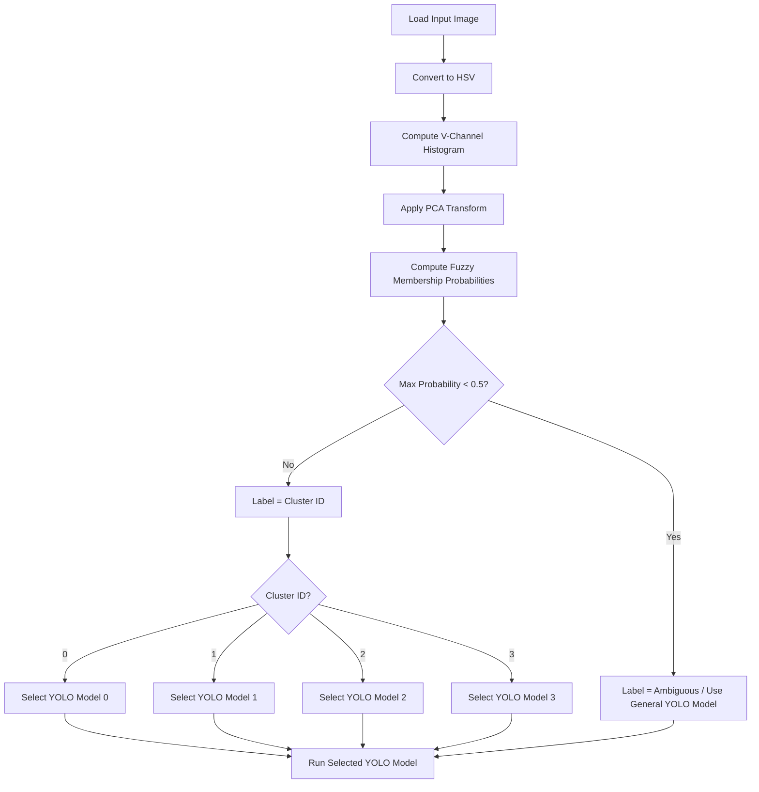

# Traffic Sign Recognition for Varying Lighting Conditions

## Project Overview

This project addresses the issue of varying lighting conditions affecting Traffic Sign Recognition Models. By using Fuzzy C Means on HSV histograms to classify images into clusters based on lighting. The project automatically classifies and image the runs YOLOv8 object detection on the image using a model trained on similar images.

## Dataset
This project used the Self Driving Cars Dataset on RoboFlow

## Training 
 * Convert RGB Images to HSV Color Space
 * Create 32 feature Histograms Based On The V value
 * Apply PCA on the Histograms to Create 16 Feature Data
 * Use Elbow Method to Determine Number of Clusters
 * Use Fuzzy C Means to Sort Images
 * Train a Model on Each Cluster
## Predict
 *Convert RGB Image to HSV Color Space
 * Create 32 feature Histogram Based On The V value
 * Apply the Trained PCA Model
 * Calculate Which Cluster the Image Belongs to
 * Select YOLO Model
 * Run Inference

## Predict Visual



## How To Use

Install Dependences
```
pip install ultralytics open-cv numpy scikit-learn scikit-fuzzy matplotlib
```

Determine Number of Clusters Using Elbow Method
```
python3 use_elbow_method.py
```
Sort Clusters
```
python3 unsupervised_classify.py
```

Predict Image
```
python3 predict_image.py
```

## Results
This system showed that it may be viable way to perform object detection in various lighting conditions. To confirm this more research must be done with a larger dataset.

Total Pipeline runs in 10 ms.

A more detailed report can be found in research_paper.pdf

