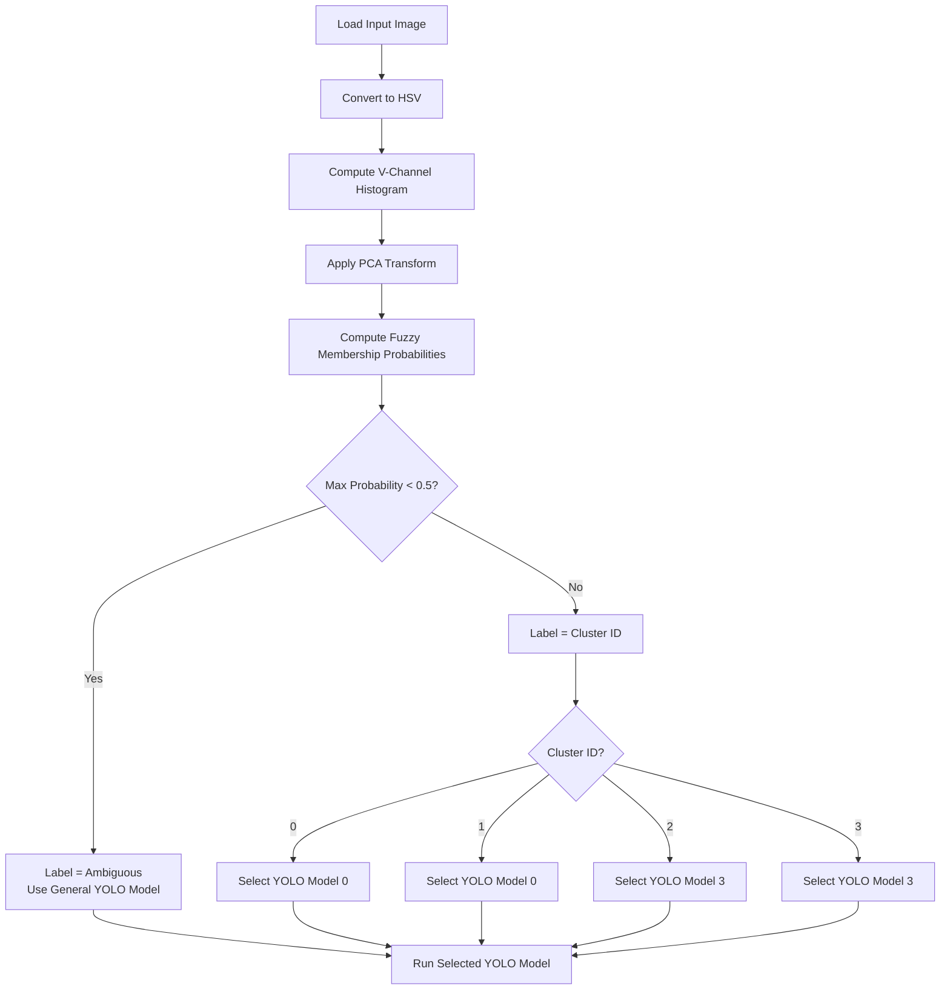

```mermaid
flowchart TD


A[Load Input Image] --> B[Convert to HSV]
B --> C[Compute V-Channel Histogram]
C --> D[Apply PCA Transform]
D --> E[Compute Fuzzy Membership Probabilities]

E --> F{Max Probability < 0.5?}

F -- Yes --> G[Label = Ambiguous\nUse General YOLO Model]
F -- No --> H[Label = Cluster ID]

H --> I{Cluster ID?}
I -- 0 --> I0[Select YOLO Model 0]
I -- 1 --> I1[Select YOLO Model 0]
I -- 2 --> I2[Select YOLO Model 3]
I -- 3 --> I3[Select YOLO Model 3]

G --> J[Run Selected YOLO Model]
I0 --> J
I1 --> J
I2 --> J
I3 --> J

```
