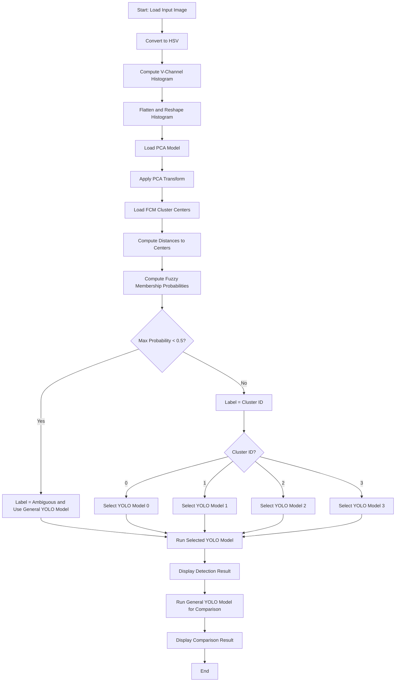

```mermaid
flowchart TD

A[Start: Load Input Image] --> B[Convert to HSV]
B --> C[Compute V-Channel Histogram]
C --> D[Flatten and Reshape Histogram]

D --> E[Load PCA Model]
E --> F[Apply PCA Transform]

F --> G[Load FCM Cluster Centers]
G --> H[Compute Distances to Centers]
H --> I[Compute Fuzzy Membership Probabilities]

I --> J{Max Probability < 0.5?}

J -- Yes --> K[Label = Ambiguous and Use General YOLO Model]
J -- No --> L[Label = Cluster ID]

L --> M{Cluster ID?}
M -- 0 --> M0[Select YOLO Model 0]
M -- 1 --> M1[Select YOLO Model 1]
M -- 2 --> M2[Select YOLO Model 2]
M -- 3 --> M3[Select YOLO Model 3]

K --> N
M0 --> N
M1 --> N
M2 --> N
M3 --> N
N[Run Selected YOLO Model] --> O[Display Detection Result]

O --> P[Run General YOLO Model for Comparison]
P --> Q[Display Comparison Result]

Q --> R[End]
```
