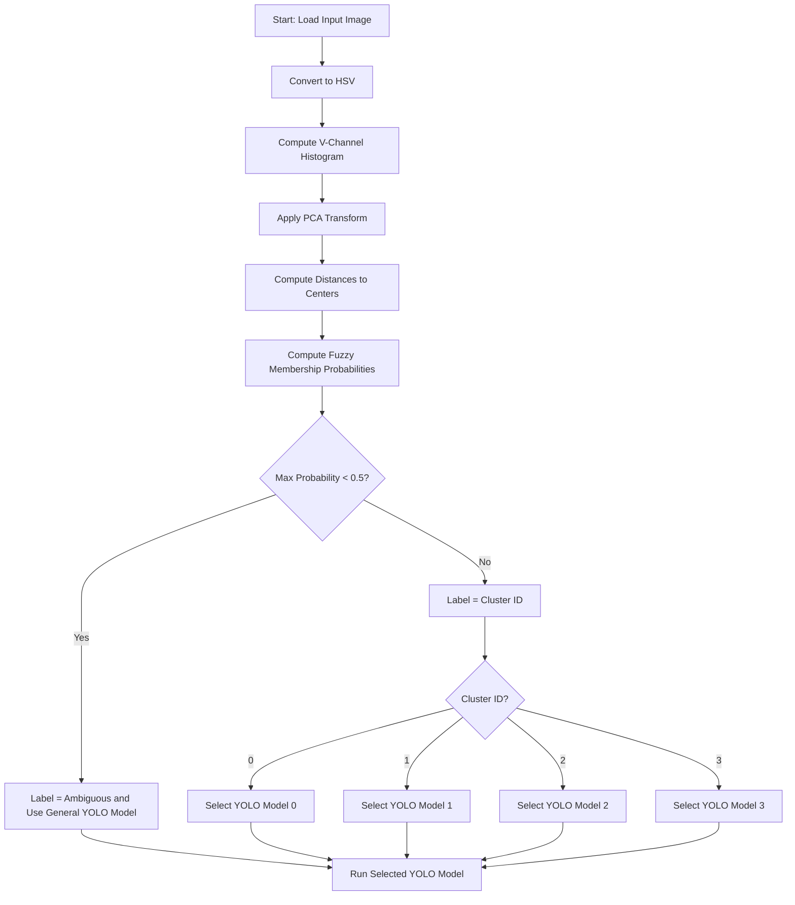

```mermaid
flowchart TD

A[Start: Load Input Image] --> B[Convert to HSV]
B --> C[Compute V-Channel Histogram]

C --> D[Apply PCA Transform]

D --> E[Compute Distances to Centers]
E --> F[Compute Fuzzy Membership Probabilities]

F --> G{Max Probability < 0.5?}

G -- Yes --> H[Label = Ambiguous and Use General YOLO Model]
G -- No --> I[Label = Cluster ID]

I --> J{Cluster ID?}
J -- 0 --> J0[Select YOLO Model 0]
J -- 1 --> J1[Select YOLO Model 1]
J -- 2 --> J2[Select YOLO Model 2]
J -- 3 --> J3[Select YOLO Model 3]

H --> K
J0 --> K
J1 --> K
J2 --> K
J3 --> K
K[Run Selected YOLO Model]
```
